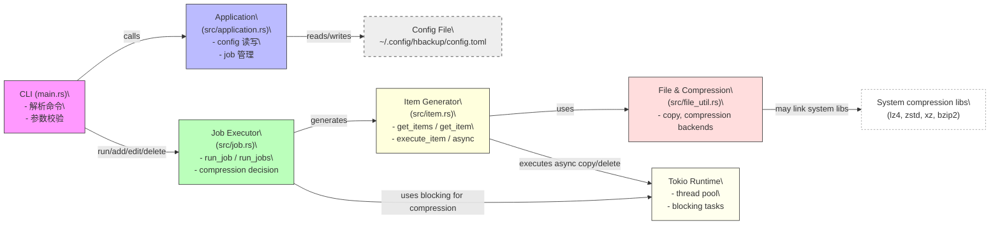
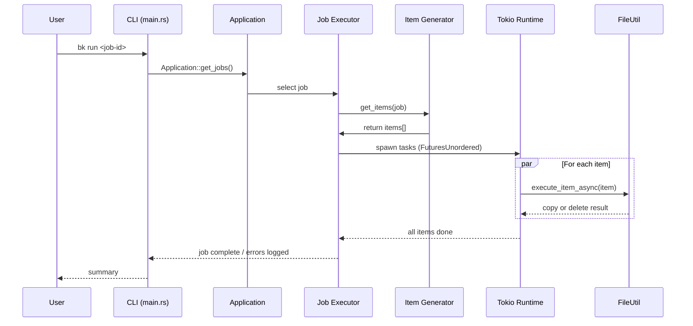
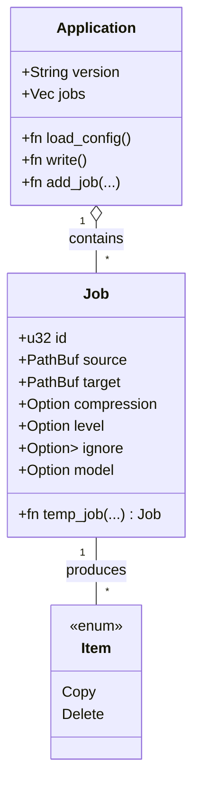

# hbackup 设计文档

本文件为 hbackup 的设计文档（中文），包含架构概览、模块职责、数据模型、并发模型、运行流程、错误处理、扩展点以及 mermaid 架构图。可直接在支持 Mermaid 的渲染器（例如 GitHub README）中查看图表。

---

## 目标与范围
- 目标：提供一个高性能、跨平台的命令行备份工具（二进制 `bk`），支持任务管理、并发备份、多种压缩格式、镜像/全量备份模型、配置管理与回滚。
- 受众：项目维护者、贡献者、系统管理员、希望扩展压缩后端或引入定时任务的开发者。

假设：运行环境为常见类 Unix（Linux/macOS）或 Windows；需要 Rust 工具链（>=1.85）和部分系统库（视压缩后端）。

## 高层架构概览
- CLI 层（`src/main.rs`）：解析命令、验证参数、触发对应操作（add/run/list/edit/delete/config）。
- 应用配置层（`src/application.rs`）：管理持久化配置（TOML 格式），提供读写与迁移、job 管理 API。
- 作业执行层（`src/job.rs`）：定义 `Job`、压缩枚举与执行逻辑。负责将单个 job 转换为执行流程（压缩或遍历目录并并行执行）。
- 项目分解与调度层（`src/item.rs`）：负责把目录中的实体映射为可执行的 Item（Copy/Delete），并提供 sync/async 执行。
- 文件与压缩实现层（`src/file_util.rs`）：实现 copy、copy_async、各压缩格式（gzip/zip/7z/zstd/bzip2/xz/lz4/tar）以及 ignore 支持。
- 共享常量（`src/constants.rs`）与库导出（`src/lib.rs`）。
- 运行时：使用 Tokio 多线程 runtime 做并发调度；对于压缩任务，使用 blocking task（spawn_blocking）。

## 主要数据模型
- Job (src/job.rs)
  - id: u32
  - source: PathBuf
  - target: PathBuf
  - compression: Option<CompressFormat>
  - level: Option<Level>
  - ignore: Option<Vec<String>>
  - model: Option<BackupModel> (Full | Mirror)
- Application (src/application.rs)
  - version: String
  - jobs: Vec<Job>
- Item (src/item.rs)
  - Copy { src, dest }
  - Delete(PathBuf)

## 核心流程（概要）
1. CLI 解析命令（add/run/list/edit/delete/config）。
2. 对 add/edit/delete：通过 `Application::load_config()` 修改内存数据并调用 `Application::write()` 序列化到 TOML（`~/.config/hbackup/config.toml`）。
3. 对 run：
   - 如果 job 指定了 compression：调用 `file_util::compression`（压缩为单文件或 tar+压缩）。
   - 否则若 source 是目录：`get_items(job)` 生成 items 列表 -> 使用 Tokio runtime 和 FuturesUnordered/JoinSet 并发执行 item。
   - 若 source 是单文件：直接 copy（或根据 model 决定是否 update）。
4. 镜像模型（Mirror）：在 `get_items` 中额外计算目标中需要删除的路径，并生成 Delete 项。删除按路径层级过滤，避免重复删除。

## 并发模型与性能注意
- 顶层并发：`run_jobs` 使用 `tokio::task::JoinSet` 为每个 job 并发启动任务（并发 job）。
- 内部并发：在处理目录时，使用 `FuturesUnordered` 将每个 file item 的异步执行并发化（并发文件拷贝）。
- CPU-bound 压缩任务使用 `tokio::task::spawn_blocking` 将阻塞操作移出异步线程池。
- 建议：当前并发度由线程池及任务数隐式决定，缺少显式的并发限制（可能在 I/O 密集型场景导致过载）。建议通过 semaphore 或配置项限制并发 job/并发文件数。

## 错误处理与退出策略
- 重大错误（如解析 config 失败、关键文件 IO 错误）会通过 `eprintln!` + process::exit 返回错误码（`sysexits`）。
- 运行 job 出错时，会打印错误但尽量让其他 job 继续（容错）。
- 建议：引入结构化日志（`tracing`）并提供可选的错误上报或重试策略。

## 配置与持久化
- 存储位置（默认）：Linux/macOS -> `~/.config/hbackup/config.toml`，Windows -> `%APPDATA%\\hbackup\\config.toml`（通过 `dirs::config_dir()` 获取）。
- 格式：TOML（`serde` + `toml` 序列化）。
- 支持：备份配置、重置（自动备份后重置）与回滚上一次备份配置。

## 安全与权限
- 文件操作可能需要正确权限。缺少写权限时会提示并建议 `chmod` 或删除目标文件后重试。
- Delete 操作（镜像模型）会实际删除目标文件，`delete --all` 有交互确认。建议增加 `--yes` 或 dry-run 模式以便自动化使用。

## 可扩展点
- 添加新压缩后端：实现 `file_util` 中对应函数并映射 level 与扩展名。
- 并发策略：在配置中增加最大并发 job 或并发文件数选项。
- dry-run 模式：显示将执行的 Item 而不实际操作。
- 定时/守护模式：集成 systemd timer / cron 或 daemon 模式。
- 更丰富的日志与 metrics：支持 `tracing` 与 Prometheus 指标导出。

## 测试建议
- 单元测试：项目已有文件级测试（item/job/file_util）。
- 集成测试：模拟多层目录、ignore、mirror 行为，验证删除/复制/压缩结果。
- 性能测试：在大文件与大量小文件场景下测试不同并发配置（可用 `criterion` 或自定义 harness）。

---

## 架构图（Mermaid）

下面的 mermaid 代码块可直接在支持 Mermaid 的渲染器中查看图形。

### 高层组件关系（flowchart）

### 序列图：运行单个目录 job

### Job 数据模型（class diagram style）

---

## 交付与后续步骤
- 我已经把设计文档放在 `docs/DESIGN.md`（此文件）。
- 推荐后续：在 CI 中渲染/验证 Mermaid（例如 GitHub 会自动渲染），并把此分支推送到远端后创建 PR 以便审阅合并。

---

（文档结束）
